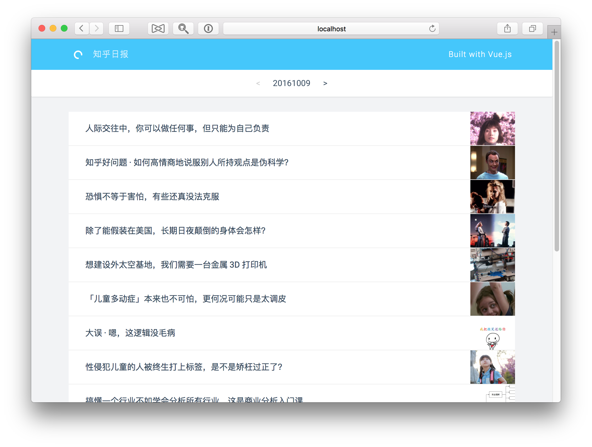

# 知乎日报 with Vue.js

[Live Demo](http://vue-zhihu.hapboy.com)

知乎日报 Web 版本，基于 Vue 2.0 + Vue-Resource + Vue-Router + Vuex 开发。

> A Vue.js & Node.js project

## Preview



## Features
- 今日热门
- 每日日报
- 文章详情
- 文章评论

## Build Setup

``` bash
# install dependencies
npm install

# run zhihu-daily api server at localhost:8088
npm run server

# serve with hot reload at localhost:8080
npm run dev

# build for production with minification
npm run build
```

## Reference

- [vue-hackernews-2.0](https://github.com/vuejs/vue-hackernews-2.0)
- [zhihu-daily-byVuejs](https://github.com/GaryChangCN/zhihu-daily-byVuejs)
- [ZhihuDailyPurify](https://github.com/izzyleung/ZhihuDailyPurify/wiki/%E7%9F%A5%E4%B9%8E%E6%97%A5%E6%8A%A5-API-%E5%88%86%E6%9E%90)

## License

[MIT](https://opensource.org/licenses/MIT)
